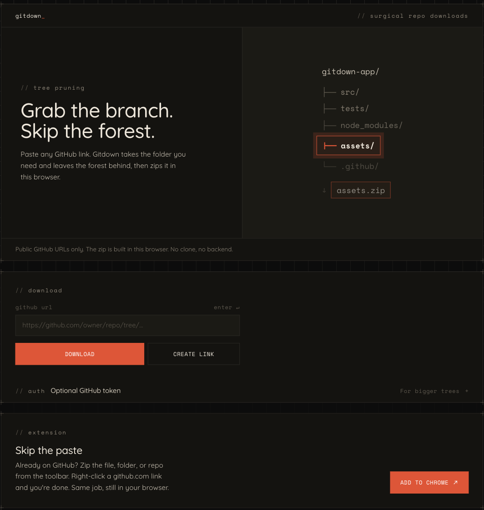

# TheGitDown

Client-side tool for downloading a public GitHub file or directory as a zip, or sharing a one-click download link. Live at [gitdown.xyz](https://gitdown.xyz).



## Deep links

Customize the zip name or root-folder behavior via:

```
https://gitdown.xyz/#/home?url=<GitHub link>&fileName=<name>&rootDirectory=<true|false|name>
```

Example (directory zip without the root folder):

```
https://gitdown.xyz/#/home?url=https://github.com/taylorsegell/TheGitDown/tree/master/images&rootDirectory=false
```

That downloads `images.zip` with the folder contents at the zip root.

## Optional GitHub token

Unauthenticated GitHub API calls are rate-limited. Paste a personal access token in the website settings to raise limits; it is stored only in this browser's `localStorage`. The companion extension has a separate Options page; its PAT lives in `chrome.storage.local` and does not share storage with gitdown.xyz. There is no TheGitDown backend for the token. The SPA and the extension talk to GitHub from the client.

## Security

A GitHub PAT was previously exposed in client source and has been removed from the working tree. Rotate any leaked credentials; do not commit tokens. History scrubbing (`git filter-repo` / BFG) is operator-owned and out-of-band. See [SECURITY.md](SECURITY.md).

## Develop

```bash
npm install
npm run dev      # Vite dev server
npm test         # Vitest
npm run build    # production static assets → dist/
```

This repo is an npm workspace. Shared download logic lives in `packages/core` (`@gitdown/core`). The companion extension is `packages/extension` (WXT; npm package name `gitdown`).

```bash
npm run ext:dev            # WXT extension dev (`npm run dev -w gitdown`)
npm run ext:build          # Chrome MV3 (`npm run build -w gitdown`) → packages/extension/.output/chrome-mv3
npm run ext:build:firefox  # Firefox MV3 (`npm run build:firefox -w gitdown`) → packages/extension/.output/firefox-mv3
```

## Companion extension

On a GitHub file, folder, or repo tab, the toolbar popup can zip the current path. Right-click a github.com link (on any site) for **Download with GitDown**. Short load notes also live in [packages/extension/README.md](packages/extension/README.md).

### Load unpacked (Chrome)

1. From the repo root, run `npm run ext:build`.
2. Open `chrome://extensions`.
3. Turn on Developer mode.
4. Click **Load unpacked**.
5. Select `packages/extension/.output/chrome-mv3`.

### Firefox temporary add-on

1. From the repo root, run `npm run ext:build:firefox`.
2. Open `about:debugging#/runtime/this-firefox`.
3. Click **Load Temporary Add-on**.
4. Select `packages/extension/.output/firefox-mv3/manifest.json`.

## License

[MIT](https://opensource.org/licenses/MIT)
